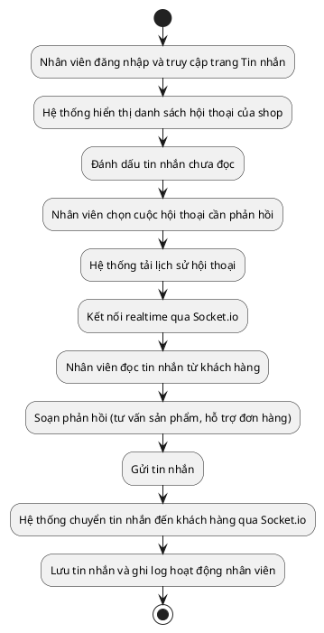

# Quy trình: Nhân viên chat với khách hàng (Employee)

```plantuml
@startuml
skinparam shadowing false

start
:Nhân viên đăng nhập và truy cập trang Tin nhắn;
:Hệ thống hiển thị danh sách hội thoại của shop;
:Đánh dấu tin nhắn chưa đọc;
:Nhân viên chọn cuộc hội thoại cần phản hồi;
:Hệ thống tải lịch sử hội thoại;
:Kết nối realtime qua Socket.io;
:Nhân viên đọc tin nhắn từ khách hàng;
:Soạn phản hồi (tư vấn sản phẩm, hỗ trợ đơn hàng);
:Gửi tin nhắn;
:Hệ thống chuyển tin nhắn đến khách hàng qua Socket.io;
:Lưu tin nhắn và ghi log hoạt động nhân viên;

stop
@enduml
```
