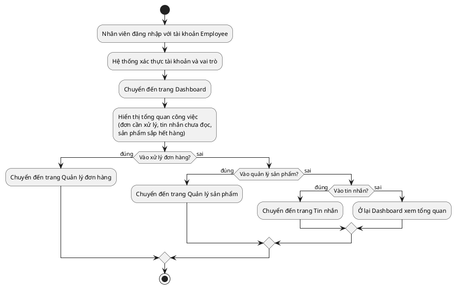

# Quy trình: Nhân viên xem Dashboard (Employee)

```plantuml
@startuml
skinparam shadowing false

start
:Nhân viên đăng nhập với tài khoản Employee;
:Hệ thống xác thực tài khoản và vai trò;
:Chuyển đến trang Dashboard;
:Hiển thị tổng quan công việc\n(đơn cần xử lý, tin nhắn chưa đọc,\nsản phẩm sắp hết hàng);

if (Vào xử lý đơn hàng?) then (đúng)
  :Chuyển đến trang Quản lý đơn hàng;
else (sai)
  if (Vào quản lý sản phẩm?) then (đúng)
    :Chuyển đến trang Quản lý sản phẩm;
  else (sai)
    if (Vào tin nhắn?) then (đúng)
      :Chuyển đến trang Tin nhắn;
    else (sai)
      :Ở lại Dashboard xem tổng quan;
    endif
  endif
endif

stop
@enduml
```
