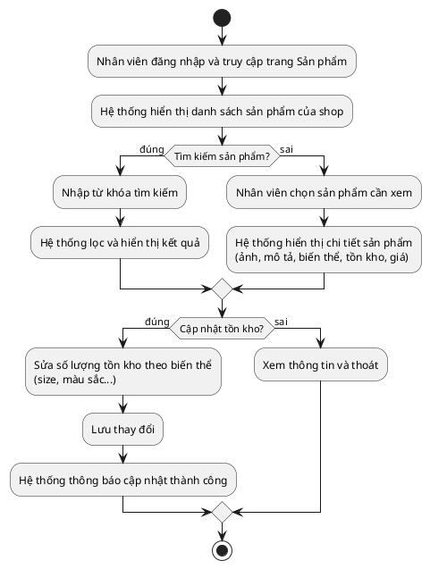

# Quy trình: Nhân viên quản lý sản phẩm (Employee)

```plantuml
@startuml
skinparam shadowing false

start
:Nhân viên đăng nhập và truy cập trang Sản phẩm;
:Hệ thống hiển thị danh sách sản phẩm của shop;

if (Tìm kiếm sản phẩm?) then (đúng)
  :Nhập từ khóa tìm kiếm;
  :Hệ thống lọc và hiển thị kết quả;
else (sai)
  :Nhân viên chọn sản phẩm cần xem;
  :Hệ thống hiển thị chi tiết sản phẩm\n(ảnh, mô tả, biến thể, tồn kho, giá);
endif

if (Cập nhật tồn kho?) then (đúng)
  :Sửa số lượng tồn kho theo biến thể\n(size, màu sắc...);
  :Lưu thay đổi;
  :Hệ thống thông báo cập nhật thành công;
else (sai)
  :Xem thông tin và thoát;
endif

stop
@enduml
```
