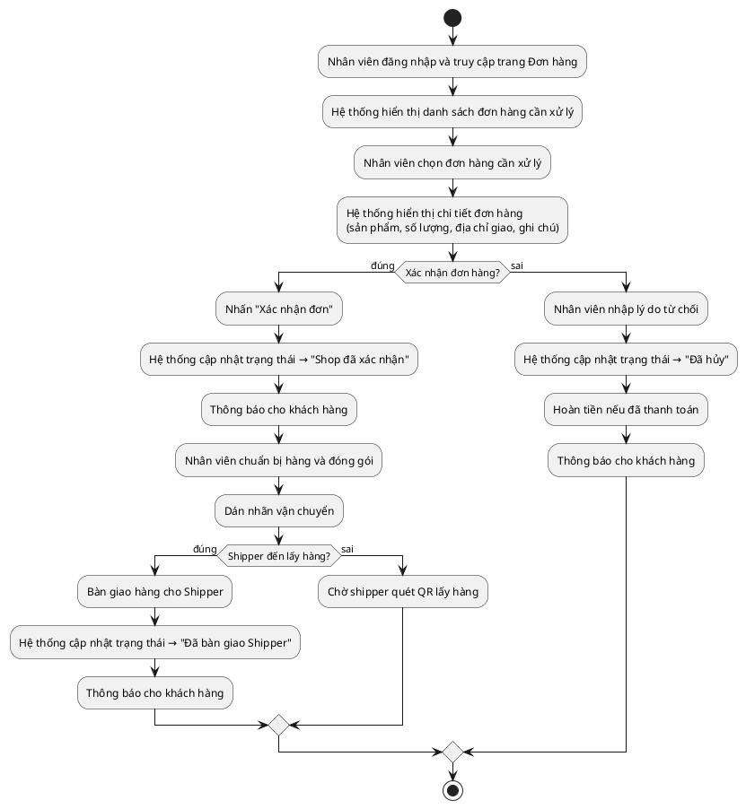

# Quy trình: Nhân viên xử lý đơn hàng (Employee)

```plantuml
@startuml
skinparam shadowing false

start
:Nhân viên đăng nhập và truy cập trang Đơn hàng;
:Hệ thống hiển thị danh sách đơn hàng cần xử lý;
:Nhân viên chọn đơn hàng cần xử lý;
:Hệ thống hiển thị chi tiết đơn hàng\n(sản phẩm, số lượng, địa chỉ giao, ghi chú);

if (Xác nhận đơn hàng?) then (đúng)
  :Nhấn "Xác nhận đơn";
  :Hệ thống cập nhật trạng thái → "Shop đã xác nhận";
  :Thông báo cho khách hàng;
  :Nhân viên chuẩn bị hàng và đóng gói;
  :Dán nhãn vận chuyển;
  if (Shipper đến lấy hàng?) then (đúng)
    :Bàn giao hàng cho Shipper;
    :Hệ thống cập nhật trạng thái → "Đã bàn giao Shipper";
    :Thông báo cho khách hàng;
  else (sai)
    :Chờ shipper quét QR lấy hàng;
  endif
else (sai)
  :Nhân viên nhập lý do từ chối;
  :Hệ thống cập nhật trạng thái → "Đã hủy";
  :Hoàn tiền nếu đã thanh toán;
  :Thông báo cho khách hàng;
endif

stop
@enduml
```
