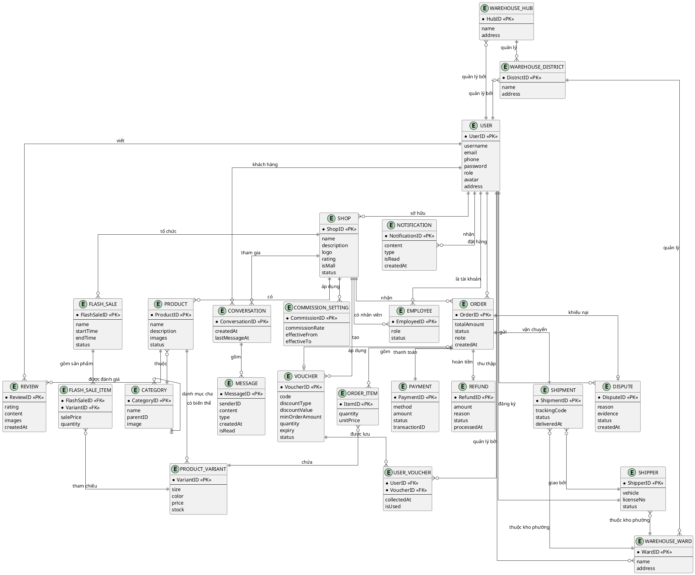

# Mô hình dữ liệu mức ý niệm — BuyZo E-Commerce Platform

```plantuml
@startuml
skinparam shadowing false
skinparam linetype ortho
skinparam EntityBackgroundColor #FFFFFF
skinparam EntityBorderColor #333333
skinparam ArrowColor #333333

' ========================
' ENTITIES
' ========================

entity "USER" as USER {
  * UserID <<PK>>
  --
  username
  email
  phone
  password
  role
  avatar
  address
}

entity "SHOP" as SHOP {
  * ShopID <<PK>>
  --
  name
  description
  logo
  rating
  isMall
  status
}

entity "EMPLOYEE" as EMPLOYEE {
  * EmployeeID <<PK>>
  --
  role
  status
}

entity "CATEGORY" as CATEGORY {
  * CategoryID <<PK>>
  --
  name
  parentID
  image
}

entity "PRODUCT" as PRODUCT {
  * ProductID <<PK>>
  --
  name
  description
  images
  status
}

entity "PRODUCT_VARIANT" as VARIANT {
  * VariantID <<PK>>
  --
  size
  color
  price
  stock
}

entity "ORDER" as ORDER {
  * OrderID <<PK>>
  --
  totalAmount
  status
  note
  createdAt
}

entity "ORDER_ITEM" as ORDER_ITEM {
  * ItemID <<PK>>
  --
  quantity
  unitPrice
}

entity "PAYMENT" as PAYMENT {
  * PaymentID <<PK>>
  --
  method
  amount
  status
  transactionID
}

entity "VOUCHER" as VOUCHER {
  * VoucherID <<PK>>
  --
  code
  discountType
  discountValue
  minOrderAmount
  quantity
  expiry
  status
}

entity "USER_VOUCHER" as USER_VOUCHER {
  * UserID <<FK>>
  * VoucherID <<FK>>
  --
  collectedAt
  isUsed
}

entity "REVIEW" as REVIEW {
  * ReviewID <<PK>>
  --
  rating
  content
  images
  createdAt
}

entity "FLASH_SALE" as FLASH_SALE {
  * FlashSaleID <<PK>>
  --
  name
  startTime
  endTime
  status
}

entity "FLASH_SALE_ITEM" as FS_ITEM {
  * FlashSaleID <<FK>>
  * VariantID <<FK>>
  --
  salePrice
  quantity
}

entity "CONVERSATION" as CONVERSATION {
  * ConversationID <<PK>>
  --
  createdAt
  lastMessageAt
}

entity "MESSAGE" as MESSAGE {
  * MessageID <<PK>>
  --
  senderID
  content
  type
  createdAt
  isRead
}

entity "NOTIFICATION" as NOTIFICATION {
  * NotificationID <<PK>>
  --
  content
  type
  isRead
  createdAt
}

entity "DISPUTE" as DISPUTE {
  * DisputeID <<PK>>
  --
  reason
  evidence
  status
  createdAt
}

entity "REFUND" as REFUND {
  * RefundID <<PK>>
  --
  amount
  reason
  status
  processedAt
}

entity "COMMISSION_SETTING" as COMMISSION {
  * CommissionID <<PK>>
  --
  commissionRate
  effectiveFrom
  effectiveTo
}

entity "SHIPPER" as SHIPPER {
  * ShipperID <<PK>>
  --
  vehicle
  licenseNo
  status
}

entity "SHIPMENT" as SHIPMENT {
  * ShipmentID <<PK>>
  --
  trackingCode
  status
  deliveredAt
}

entity "WAREHOUSE_HUB" as HUB {
  * HubID <<PK>>
  --
  name
  address
}

entity "WAREHOUSE_DISTRICT" as DISTRICT {
  * DistrictID <<PK>>
  --
  name
  address
}

entity "WAREHOUSE_WARD" as WARD {
  * WardID <<PK>>
  --
  name
  address
}

' ========================
' RELATIONSHIPS
' ========================

' User — Shop
USER ||--o{ SHOP : "sở hữu"
USER ||--o{ ORDER : "đặt hàng"
USER ||--o{ REVIEW : "viết"
USER ||--o{ NOTIFICATION : "nhận"
USER ||--o{ USER_VOUCHER : "thu thập"
USER ||--o{ DISPUTE : "gửi"
USER ||--|| SHIPPER : "đăng ký"

' Shop — related
SHOP ||--o{ PRODUCT : "có"
SHOP ||--o{ VOUCHER : "tạo"
SHOP ||--o{ FLASH_SALE : "tổ chức"
SHOP ||--o{ EMPLOYEE : "có nhân viên"
SHOP ||--o{ ORDER : "nhận"
SHOP ||--o{ COMMISSION : "áp dụng"
SHOP ||--o{ CONVERSATION : "tham gia"

' Employee
EMPLOYEE }o--|| USER : "là tài khoản"

' Product — related
PRODUCT }o--|| CATEGORY : "thuộc"
PRODUCT ||--o{ VARIANT : "có biến thể"
PRODUCT ||--o{ REVIEW : "được đánh giá"

' Category — self reference
CATEGORY }o--o| CATEGORY : "danh mục cha"

' Order — related
ORDER ||--o{ ORDER_ITEM : "gồm"
ORDER ||--|| PAYMENT : "thanh toán"
ORDER ||--o| DISPUTE : "khiếu nại"
ORDER ||--o| REFUND : "hoàn tiền"
ORDER ||--|| SHIPMENT : "vận chuyển"
ORDER }o--o| VOUCHER : "áp dụng"

' Order item
ORDER_ITEM }o--|| VARIANT : "chứa"

' Voucher
VOUCHER ||--o{ USER_VOUCHER : "được lưu"

' Flash Sale
FLASH_SALE ||--o{ FS_ITEM : "gồm sản phẩm"
FS_ITEM }o--|| VARIANT : "tham chiếu"

' Chat
CONVERSATION }o--|| USER : "khách hàng"
CONVERSATION ||--o{ MESSAGE : "gồm"

' Shipment — Warehouse — Shipper
SHIPMENT }o--|| SHIPPER : "giao bởi"
SHIPMENT }o--|| WARD : "thuộc kho phường"

' Warehouse hierarchy
HUB ||--o{ DISTRICT : "quản lý"
DISTRICT ||--o{ WARD : "quản lý"

' Hub/District/Ward manager là USER
HUB }o--|| USER : "quản lý bởi"
DISTRICT }o--|| USER : "quản lý bởi"
WARD }o--|| USER : "quản lý bởi"
SHIPPER }o--|| WARD : "thuộc kho phường"

@enduml
```
