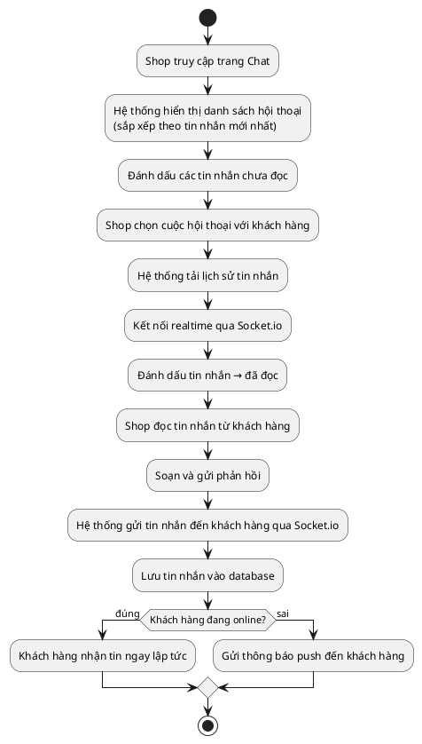

# Quy trình: Chat với Khách hàng (Shop)

```plantuml
@startuml
skinparam shadowing false

start
:Shop truy cập trang Chat;
:Hệ thống hiển thị danh sách hội thoại\n(sắp xếp theo tin nhắn mới nhất);
:Đánh dấu các tin nhắn chưa đọc;
:Shop chọn cuộc hội thoại với khách hàng;
:Hệ thống tải lịch sử tin nhắn;
:Kết nối realtime qua Socket.io;
:Đánh dấu tin nhắn → đã đọc;
:Shop đọc tin nhắn từ khách hàng;
:Soạn và gửi phản hồi;
:Hệ thống gửi tin nhắn đến khách hàng qua Socket.io;
:Lưu tin nhắn vào database;

if (Khách hàng đang online?) then (đúng)
  :Khách hàng nhận tin ngay lập tức;
else (sai)
  :Gửi thông báo push đến khách hàng;
endif

stop
@enduml
```
