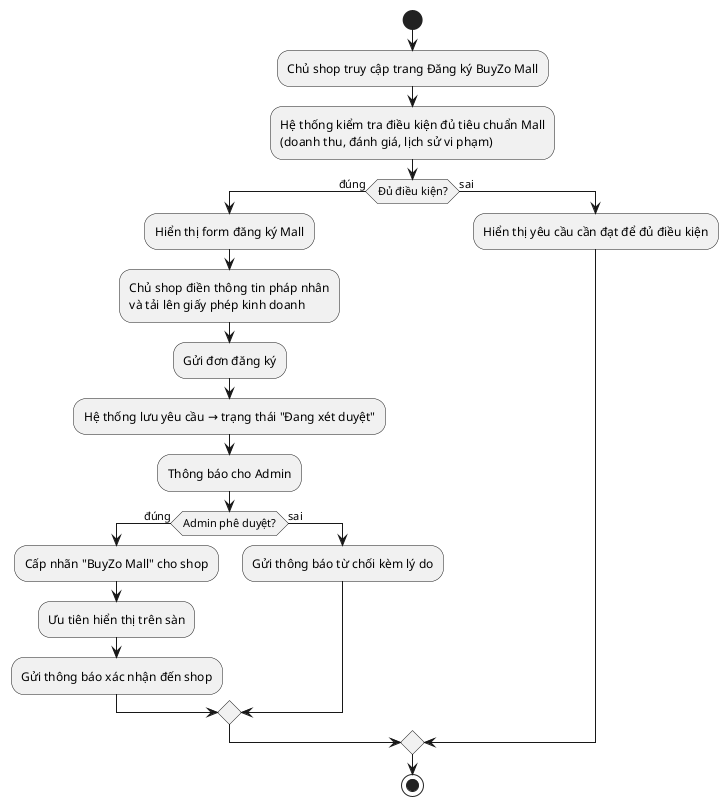

# Quy trình: Đăng ký BuyZo Mall (Shop)

```plantuml
@startuml
skinparam shadowing false

start
:Chủ shop truy cập trang Đăng ký BuyZo Mall;
:Hệ thống kiểm tra điều kiện đủ tiêu chuẩn Mall\n(doanh thu, đánh giá, lịch sử vi phạm);

if (Đủ điều kiện?) then (đúng)
  :Hiển thị form đăng ký Mall;
  :Chủ shop điền thông tin pháp nhân\nvà tải lên giấy phép kinh doanh;
  :Gửi đơn đăng ký;
  :Hệ thống lưu yêu cầu → trạng thái "Đang xét duyệt";
  :Thông báo cho Admin;
  if (Admin phê duyệt?) then (đúng)
    :Cấp nhãn "BuyZo Mall" cho shop;
    :Ưu tiên hiển thị trên sàn;
    :Gửi thông báo xác nhận đến shop;
  else (sai)
    :Gửi thông báo từ chối kèm lý do;
  endif
else (sai)
  :Hiển thị yêu cầu cần đạt để đủ điều kiện;
endif

stop
@enduml
```
