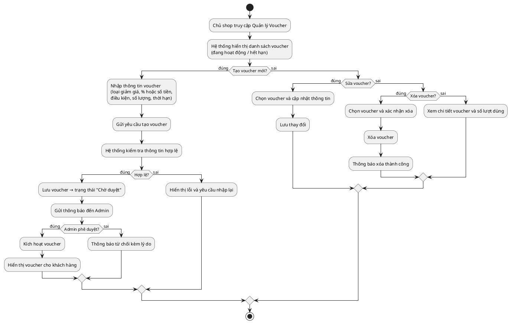

# Quy trình: Quản lý Voucher (Shop)

```plantuml
@startuml
skinparam shadowing false

start
:Chủ shop truy cập Quản lý Voucher;
:Hệ thống hiển thị danh sách voucher\n(đang hoạt động / hết hạn);

if (Tạo voucher mới?) then (đúng)
  :Nhập thông tin voucher\n(loại giảm giá, % hoặc số tiền,\nđiều kiện, số lượng, thời hạn);
  :Gửi yêu cầu tạo voucher;
  :Hệ thống kiểm tra thông tin hợp lệ;
  if (Hợp lệ?) then (đúng)
    :Lưu voucher → trạng thái "Chờ duyệt";
    :Gửi thông báo đến Admin;
    if (Admin phê duyệt?) then (đúng)
      :Kích hoạt voucher;
      :Hiển thị voucher cho khách hàng;
    else (sai)
      :Thông báo từ chối kèm lý do;
    endif
  else (sai)
    :Hiển thị lỗi và yêu cầu nhập lại;
  endif
else (sai)
  if (Sửa voucher?) then (đúng)
    :Chọn voucher và cập nhật thông tin;
    :Lưu thay đổi;
  else (sai)
    if (Xóa voucher?) then (đúng)
      :Chọn voucher và xác nhận xóa;
      :Xóa voucher;
      :Thông báo xóa thành công;
    else (sai)
      :Xem chi tiết voucher và số lượt dùng;
    endif
  endif
endif

stop
@enduml
```
