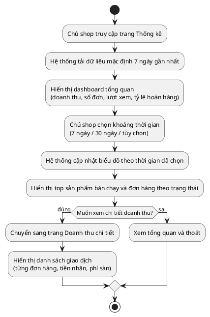

# Quy trình: Xem Analytics / Thống kê (Shop)

```plantuml
@startuml
skinparam shadowing false

start
:Chủ shop truy cập trang Thống kê;
:Hệ thống tải dữ liệu mặc định 7 ngày gần nhất;
:Hiển thị dashboard tổng quan\n(doanh thu, số đơn, lượt xem, tỷ lệ hoàn hàng);
:Chủ shop chọn khoảng thời gian\n(7 ngày / 30 ngày / tùy chọn);
:Hệ thống cập nhật biểu đồ theo thời gian đã chọn;
:Hiển thị top sản phẩm bán chạy và đơn hàng theo trạng thái;

if (Muốn xem chi tiết doanh thu?) then (đúng)
  :Chuyển sang trang Doanh thu chi tiết;
  :Hiển thị danh sách giao dịch\n(từng đơn hàng, tiền nhận, phí sàn);
else (sai)
  :Xem tổng quan và thoát;
endif

stop
@enduml
```
