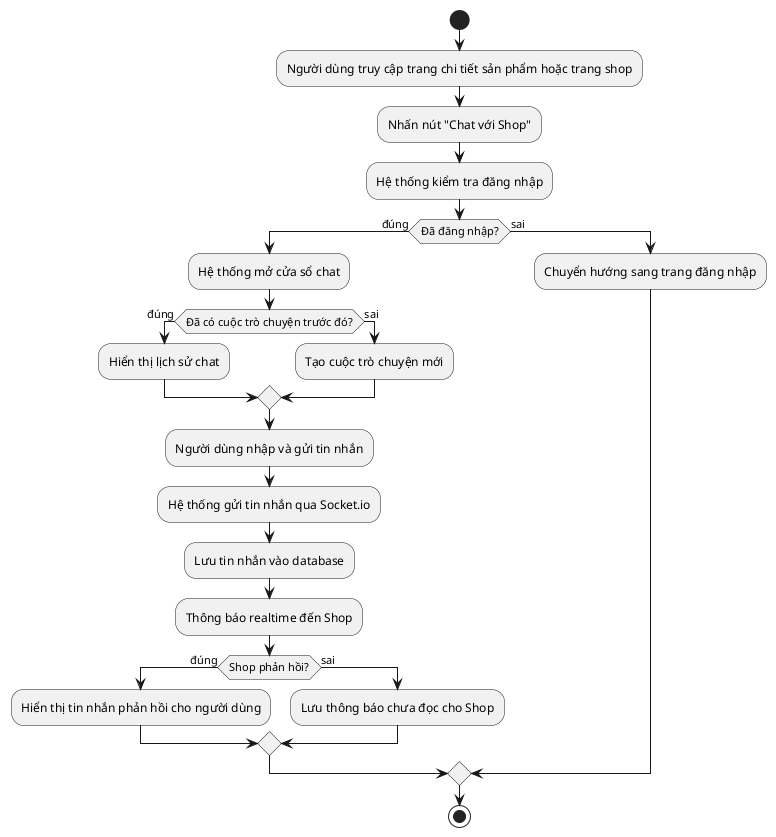

# Quy trình: Chat với Shop (User)

```plantuml
@startuml
skinparam shadowing false

start
:Người dùng truy cập trang chi tiết sản phẩm hoặc trang shop;
:Nhấn nút "Chat với Shop";
:Hệ thống kiểm tra đăng nhập;

if (Đã đăng nhập?) then (đúng)
  :Hệ thống mở cửa sổ chat;
  if (Đã có cuộc trò chuyện trước đó?) then (đúng)
    :Hiển thị lịch sử chat;
  else (sai)
    :Tạo cuộc trò chuyện mới;
  endif
  :Người dùng nhập và gửi tin nhắn;
  :Hệ thống gửi tin nhắn qua Socket.io;
  :Lưu tin nhắn vào database;
  :Thông báo realtime đến Shop;
  if (Shop phản hồi?) then (đúng)
    :Hiển thị tin nhắn phản hồi cho người dùng;
  else (sai)
    :Lưu thông báo chưa đọc cho Shop;
  endif
else (sai)
  :Chuyển hướng sang trang đăng nhập;
endif

stop
@enduml
```
