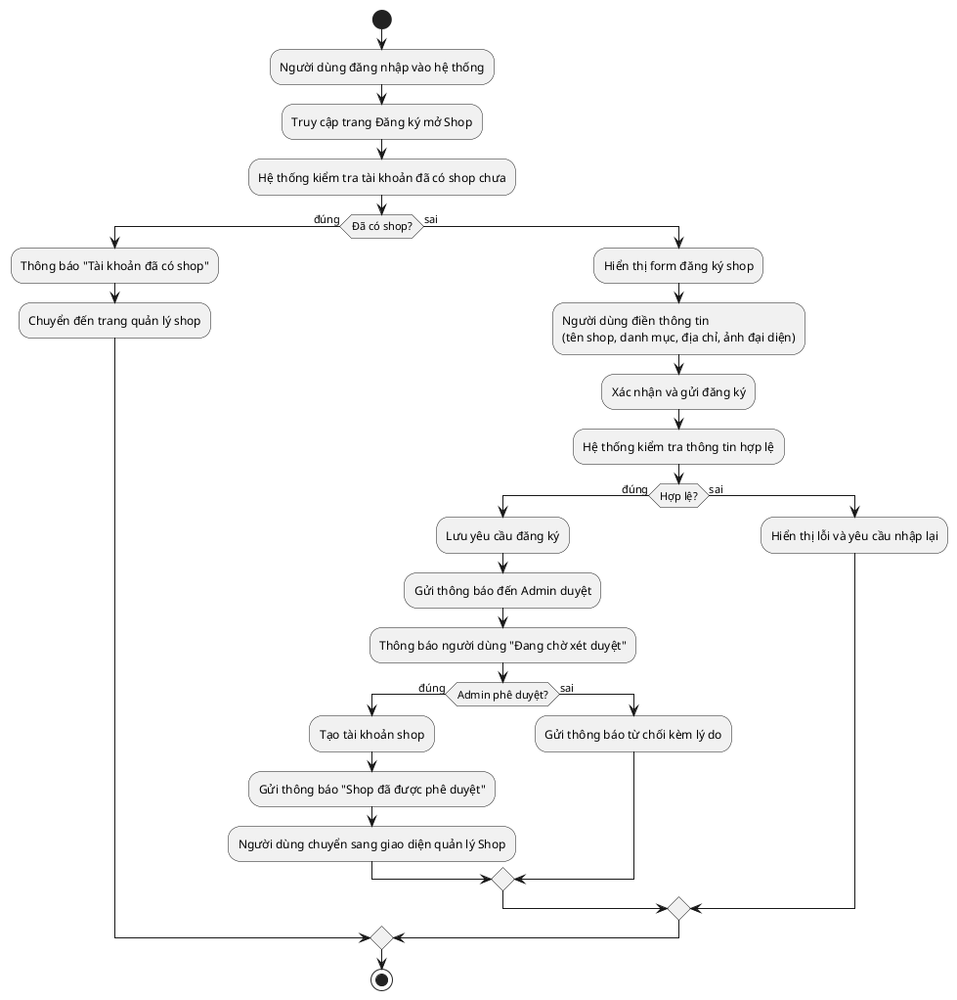

# Quy trình: Đăng ký mở Shop (User)

```plantuml
@startuml
skinparam shadowing false

start
:Người dùng đăng nhập vào hệ thống;
:Truy cập trang Đăng ký mở Shop;
:Hệ thống kiểm tra tài khoản đã có shop chưa;

if (Đã có shop?) then (đúng)
  :Thông báo "Tài khoản đã có shop";
  :Chuyển đến trang quản lý shop;
else (sai)
  :Hiển thị form đăng ký shop;
  :Người dùng điền thông tin\n(tên shop, danh mục, địa chỉ, ảnh đại diện);
  :Xác nhận và gửi đăng ký;
  :Hệ thống kiểm tra thông tin hợp lệ;
  if (Hợp lệ?) then (đúng)
    :Lưu yêu cầu đăng ký;
    :Gửi thông báo đến Admin duyệt;
    :Thông báo người dùng "Đang chờ xét duyệt";
    if (Admin phê duyệt?) then (đúng)
      :Tạo tài khoản shop;
      :Gửi thông báo "Shop đã được phê duyệt";
      :Người dùng chuyển sang giao diện quản lý Shop;
    else (sai)
      :Gửi thông báo từ chối kèm lý do;
    endif
  else (sai)
    :Hiển thị lỗi và yêu cầu nhập lại;
  endif
endif

stop
@enduml
```
