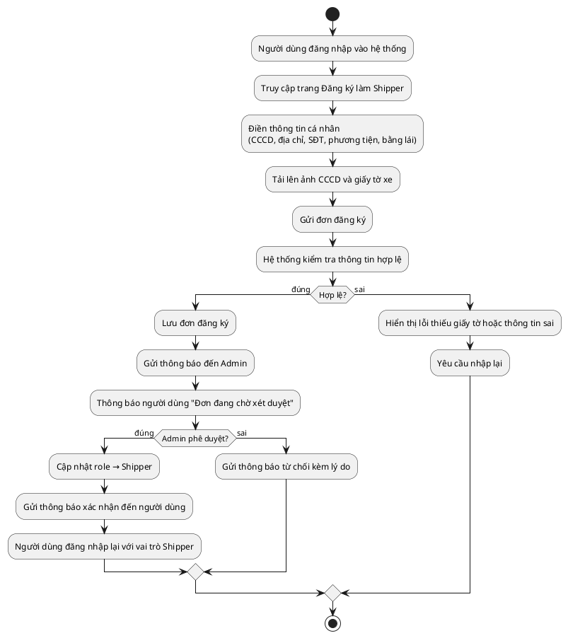

# Quy trình: Đăng ký làm Shipper (User)

```plantuml
@startuml
skinparam shadowing false

start
:Người dùng đăng nhập vào hệ thống;
:Truy cập trang Đăng ký làm Shipper;
:Điền thông tin cá nhân\n(CCCD, địa chỉ, SĐT, phương tiện, bằng lái);
:Tải lên ảnh CCCD và giấy tờ xe;
:Gửi đơn đăng ký;
:Hệ thống kiểm tra thông tin hợp lệ;

if (Hợp lệ?) then (đúng)
  :Lưu đơn đăng ký;
  :Gửi thông báo đến Admin;
  :Thông báo người dùng "Đơn đang chờ xét duyệt";
  if (Admin phê duyệt?) then (đúng)
    :Cập nhật role → Shipper;
    :Gửi thông báo xác nhận đến người dùng;
    :Người dùng đăng nhập lại với vai trò Shipper;
  else (sai)
    :Gửi thông báo từ chối kèm lý do;
  endif
else (sai)
  :Hiển thị lỗi thiếu giấy tờ hoặc thông tin sai;
  :Yêu cầu nhập lại;
endif

stop
@enduml
```
