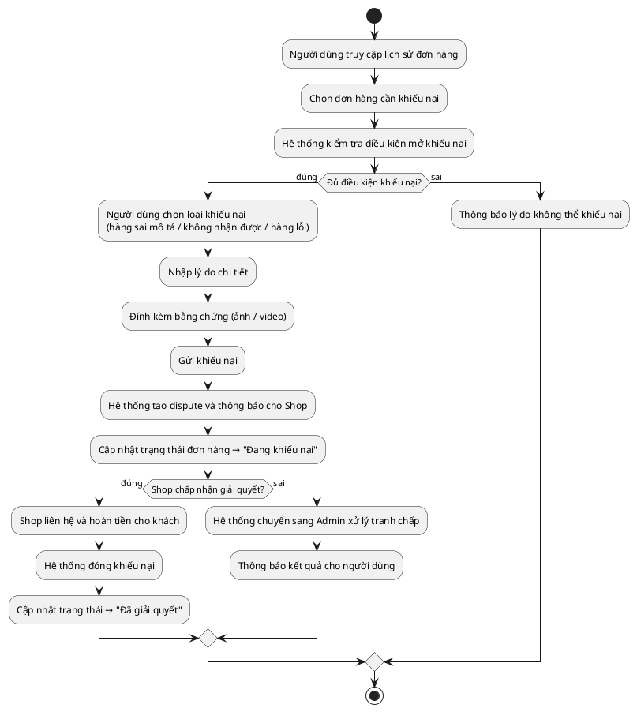

# Quy trình: Gửi Khiếu nại / Tranh chấp (User)

```plantuml
@startuml
skinparam shadowing false

start
:Người dùng truy cập lịch sử đơn hàng;
:Chọn đơn hàng cần khiếu nại;
:Hệ thống kiểm tra điều kiện mở khiếu nại;

if (Đủ điều kiện khiếu nại?) then (đúng)
  :Người dùng chọn loại khiếu nại\n(hàng sai mô tả / không nhận được / hàng lỗi);
  :Nhập lý do chi tiết;
  :Đính kèm bằng chứng (ảnh / video);
  :Gửi khiếu nại;
  :Hệ thống tạo dispute và thông báo cho Shop;
  :Cập nhật trạng thái đơn hàng → "Đang khiếu nại";
  if (Shop chấp nhận giải quyết?) then (đúng)
    :Shop liên hệ và hoàn tiền cho khách;
    :Hệ thống đóng khiếu nại;
    :Cập nhật trạng thái → "Đã giải quyết";
  else (sai)
    :Hệ thống chuyển sang Admin xử lý tranh chấp;
    :Thông báo kết quả cho người dùng;
  endif
else (sai)
  :Thông báo lý do không thể khiếu nại;
endif

stop
@enduml
```
