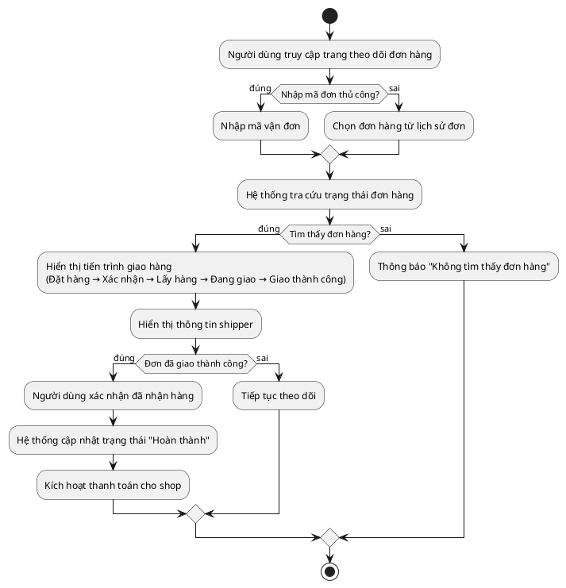

# Quy trình: Theo dõi đơn hàng (User)

```plantuml
@startuml
skinparam shadowing false

start
:Người dùng truy cập trang theo dõi đơn hàng;

if (Nhập mã đơn thủ công?) then (đúng)
  :Nhập mã vận đơn;
else (sai)
  :Chọn đơn hàng từ lịch sử đơn;
endif

:Hệ thống tra cứu trạng thái đơn hàng;

if (Tìm thấy đơn hàng?) then (đúng)
  :Hiển thị tiến trình giao hàng\n(Đặt hàng → Xác nhận → Lấy hàng → Đang giao → Giao thành công);
  :Hiển thị thông tin shipper;
  if (Đơn đã giao thành công?) then (đúng)
    :Người dùng xác nhận đã nhận hàng;
    :Hệ thống cập nhật trạng thái "Hoàn thành";
    :Kích hoạt thanh toán cho shop;
  else (sai)
    :Tiếp tục theo dõi;
  endif
else (sai)
  :Thông báo "Không tìm thấy đơn hàng";
endif

stop
@enduml
```
