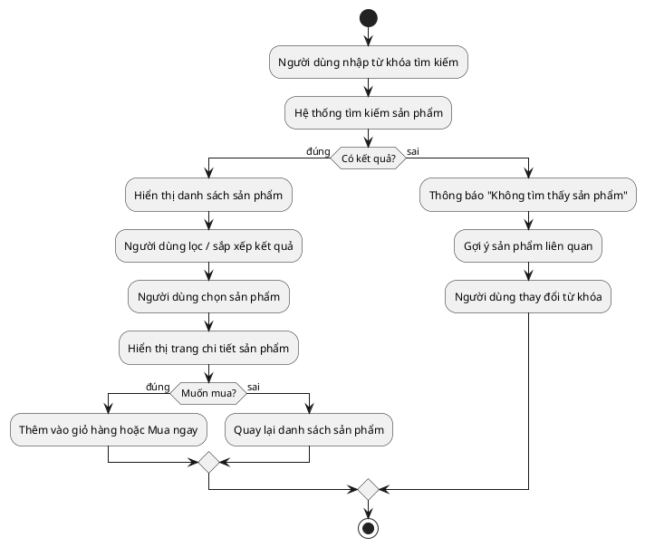

# Quy trình: Tìm kiếm & Xem sản phẩm (User)

```plantuml
@startuml
skinparam shadowing false

start
:Người dùng nhập từ khóa tìm kiếm;
:Hệ thống tìm kiếm sản phẩm;

if (Có kết quả?) then (đúng)
  :Hiển thị danh sách sản phẩm;
  :Người dùng lọc / sắp xếp kết quả;
  :Người dùng chọn sản phẩm;
  :Hiển thị trang chi tiết sản phẩm;
  if (Muốn mua?) then (đúng)
    :Thêm vào giỏ hàng hoặc Mua ngay;
  else (sai)
    :Quay lại danh sách sản phẩm;
  endif
else (sai)
  :Thông báo "Không tìm thấy sản phẩm";
  :Gợi ý sản phẩm liên quan;
  :Người dùng thay đổi từ khóa;
endif

stop
@enduml
```
