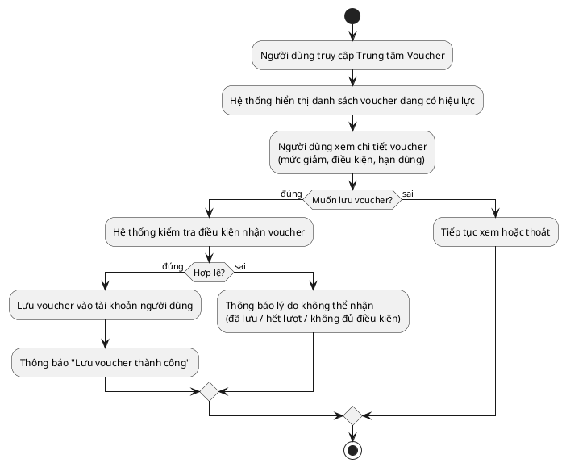

# Quy trình: Xem & Nhận Voucher (User)

```plantuml
@startuml
skinparam shadowing false

start
:Người dùng truy cập Trung tâm Voucher;
:Hệ thống hiển thị danh sách voucher đang có hiệu lực;
:Người dùng xem chi tiết voucher\n(mức giảm, điều kiện, hạn dùng);

if (Muốn lưu voucher?) then (đúng)
  :Hệ thống kiểm tra điều kiện nhận voucher;
  if (Hợp lệ?) then (đúng)
    :Lưu voucher vào tài khoản người dùng;
    :Thông báo "Lưu voucher thành công";
  else (sai)
    :Thông báo lý do không thể nhận\n(đã lưu / hết lượt / không đủ điều kiện);
  endif
else (sai)
  :Tiếp tục xem hoặc thoát;
endif

stop
@enduml
```
