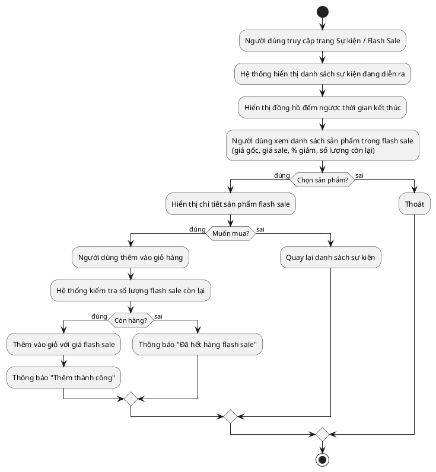

# Quy trình: Xem Sự kiện / Flash Sale (User)

```plantuml
@startuml
skinparam shadowing false

start
:Người dùng truy cập trang Sự kiện / Flash Sale;
:Hệ thống hiển thị danh sách sự kiện đang diễn ra;
:Hiển thị đồng hồ đếm ngược thời gian kết thúc;
:Người dùng xem danh sách sản phẩm trong flash sale\n(giá gốc, giá sale, % giảm, số lượng còn lại);

if (Chọn sản phẩm?) then (đúng)
  :Hiển thị chi tiết sản phẩm flash sale;
  if (Muốn mua?) then (đúng)
    :Người dùng thêm vào giỏ hàng;
    :Hệ thống kiểm tra số lượng flash sale còn lại;
    if (Còn hàng?) then (đúng)
      :Thêm vào giỏ với giá flash sale;
      :Thông báo "Thêm thành công";
    else (sai)
      :Thông báo "Đã hết hàng flash sale";
    endif
  else (sai)
    :Quay lại danh sách sự kiện;
  endif
else (sai)
  :Thoát;
endif

stop
@enduml
```
