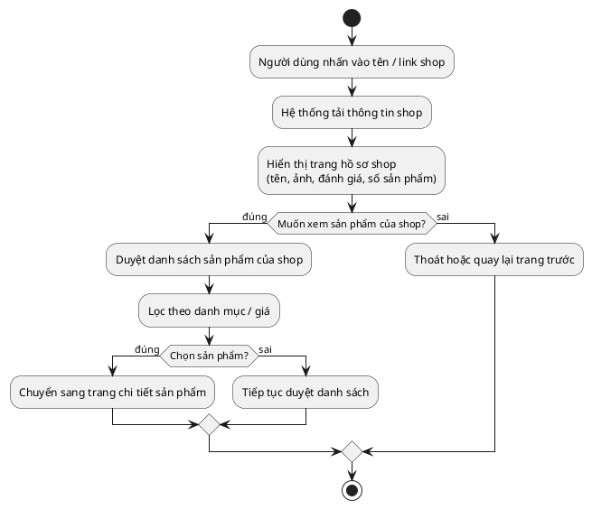

# Quy trình: Xem trang Shop (User)

```plantuml
@startuml
skinparam shadowing false

start
:Người dùng nhấn vào tên / link shop;
:Hệ thống tải thông tin shop;
:Hiển thị trang hồ sơ shop\n(tên, ảnh, đánh giá, số sản phẩm);

if (Muốn xem sản phẩm của shop?) then (đúng)
  :Duyệt danh sách sản phẩm của shop;
  :Lọc theo danh mục / giá;
  if (Chọn sản phẩm?) then (đúng)
    :Chuyển sang trang chi tiết sản phẩm;
  else (sai)
    :Tiếp tục duyệt danh sách;
  endif
else (sai)
  :Thoát hoặc quay lại trang trước;
endif

stop
@enduml
```
