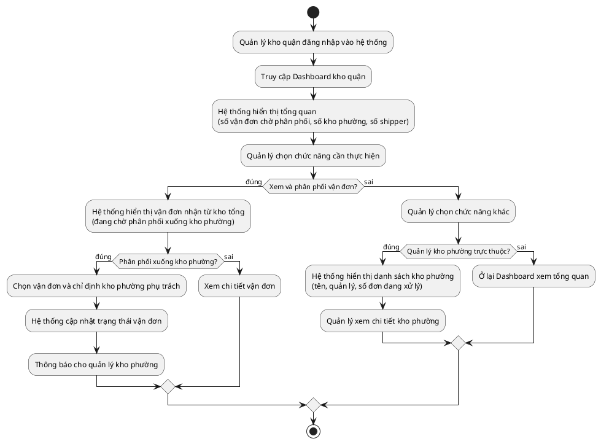

# Quy trình: Quản lý Kho Quận (Cấp 2)

## Tóm tắt
Nhận lô hàng từ kho tổng, chia nhỏ ra và phân phối xuống từng kho phường phụ trách.

## Mô tả
Quản lý kho quận đăng nhập vào hệ thống và truy cập trang tổng quan kho quận, hệ thống hiển thị số vận đơn đang chờ phân phối, số kho phường và số shipper đang hoạt động. Nếu quản lý muốn xem và phân phối vận đơn thì hệ thống hiển thị danh sách vận đơn nhận từ kho tổng đang chờ phân phối xuống kho phường. Nếu muốn phân phối thì chọn vận đơn và chỉ định kho phường phụ trách, hệ thống cập nhật trạng thái vận đơn và thông báo cho quản lý kho phường, còn nếu không thì xem chi tiết vận đơn. Nếu quản lý muốn xem danh sách kho phường trực thuộc thì hệ thống hiển thị tên, người quản lý và số đơn đang xử lý tại từng kho phường. Trường hợp không thực hiện thao tác nào thì ở lại trang tổng quan và kết thúc.

## Sơ đồ

