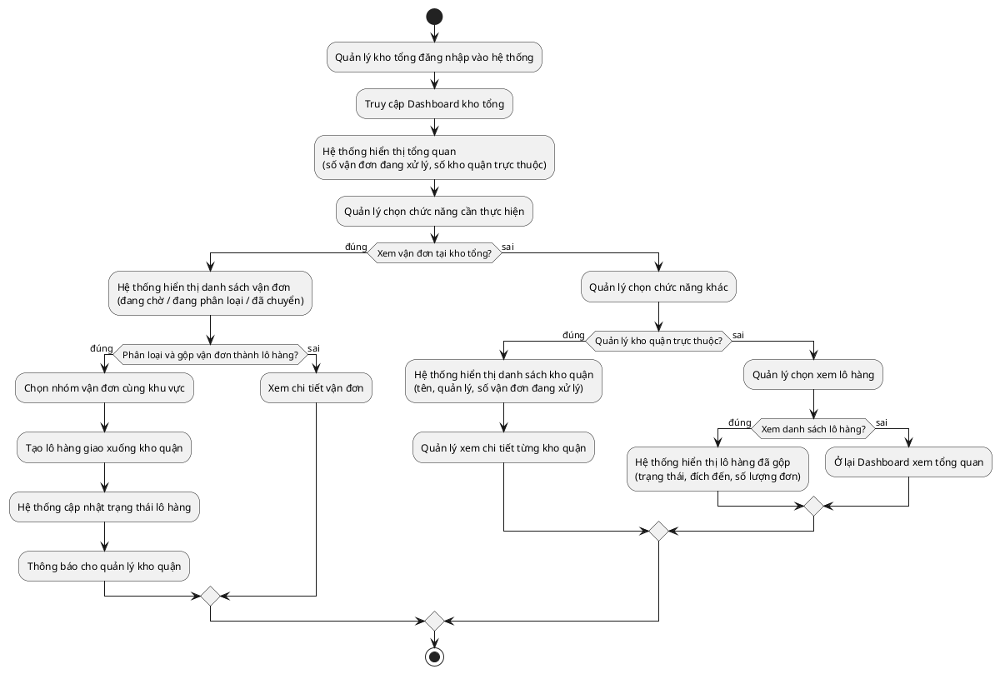

# Quy trình: Quản lý Kho Tổng (Cấp 1)

## Tóm tắt
Nhận hàng từ tất cả các shop, phân loại rồi gom thành lô hàng theo khu vực, chuyển xuống kho quận.

## Mô tả
Quản lý kho tổng đăng nhập vào hệ thống và truy cập trang tổng quan kho tổng, hệ thống hiển thị số vận đơn đang xử lý và số kho quận trực thuộc. Nếu quản lý muốn xem vận đơn tại kho tổng thì hệ thống hiển thị danh sách vận đơn theo trạng thái đang chờ, đang phân loại hoặc đã chuyển. Nếu muốn phân loại và gộp các vận đơn cùng khu vực thành một lô thì chọn nhóm vận đơn, tạo lô hàng giao xuống kho quận, hệ thống cập nhật trạng thái lô hàng và thông báo cho quản lý kho quận, còn nếu không thì xem chi tiết vận đơn. Nếu quản lý muốn xem danh sách kho quận trực thuộc thì hệ thống hiển thị tên, người quản lý và số vận đơn đang xử lý tại từng kho quận. Trường hợp không thực hiện thao tác nào thì ở lại trang tổng quan và kết thúc.

## Sơ đồ

