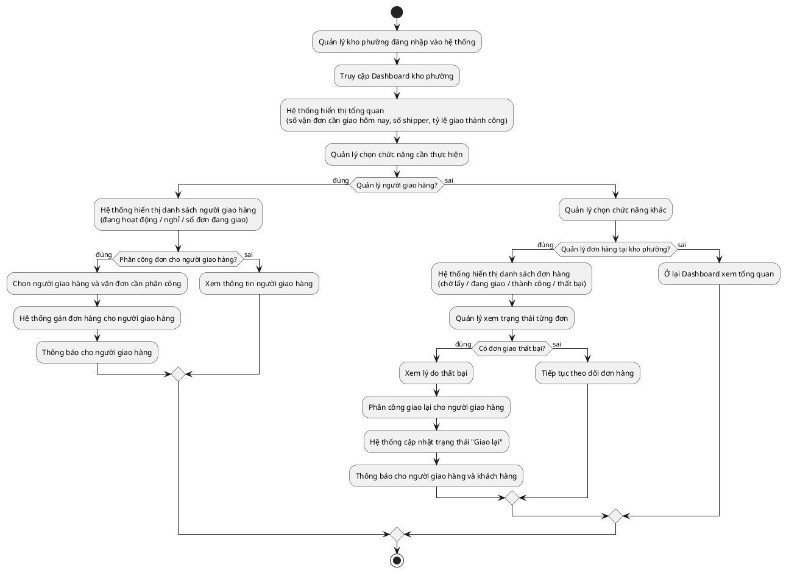

# Quy trình: Quản lý Kho Phường (Cấp 3)

## Tóm tắt
Nhận đơn từ kho quận, phân công cho shipper đi giao đến tay khách hàng. Nếu giao thất bại thì phân công giao lại.

## Mô tả
Quản lý kho phường đăng nhập vào hệ thống và truy cập trang tổng quan kho phường, hệ thống hiển thị số vận đơn cần giao trong ngày, số shipper và tỷ lệ giao hàng thành công. Nếu quản lý muốn quản lý shipper thì hệ thống hiển thị danh sách shipper theo trạng thái đang hoạt động, nghỉ và số đơn đang giao. Nếu muốn phân công đơn thì chọn shipper và vận đơn cần phân công, hệ thống gán đơn hàng và thông báo cho shipper, còn nếu không thì xem thông tin shipper. Nếu quản lý muốn xem đơn hàng tại kho thì hệ thống hiển thị danh sách theo trạng thái chờ lấy, đang giao, thành công và thất bại. Nếu có đơn giao thất bại thì xem lý do, phân công giao lại cho shipper, hệ thống cập nhật trạng thái "Giao lại" và thông báo cho shipper cùng khách hàng, còn nếu không có đơn thất bại thì tiếp tục theo dõi. Trường hợp không thực hiện thao tác nào thì ở lại trang tổng quan và kết thúc.

## Sơ đồ

